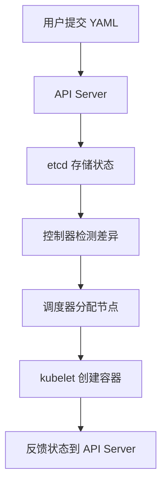

Kubernetes（K8s）的基本工作原理围绕**自动化容器编排**展开，其核心是通过声明式配置和控制器模式，将用户期望的状态（Desired State）与实际状态（Actual State）保持一致。以下是其核心工作机制的分解：

---

### **一、核心架构组件**

K8s 由两部分组成：

1. **控制平面（Control Plane）**：大脑，负责决策和协调。
   - **API Server**：唯一与用户交互的入口，处理所有请求（如 `kubectl` 命令）。
   - **Scheduler**：决定将 Pod 分配到哪个节点。
   - **Controller Manager**：运行各种控制器（如 Deployment、Node 控制器），确保系统状态符合预期。
   - **etcd**：分布式键值数据库，存储集群所有状态数据。

2. **工作节点（Worker Nodes）**：执行实际工作负载。
   - **kubelet**：节点上的“代理”，负责管理容器生命周期。
   - **kube-proxy**：处理网络规则（如 Service 的负载均衡）。
   - **容器运行时**（如 containerd、Docker）：真正运行容器的工具。

---

### **二、核心工作原理**

#### 1. **声明式 API 与期望状态**

用户通过 YAML/JSON 文件声明应用的期望状态（如“运行 3 个 Nginx 副本”），提交给 API Server：
```yaml
apiVersion: apps/v1
kind: Deployment
spec:
  replicas: 3  # 期望状态：3个Pod
  template:
    spec:
      containers:
      - name: nginx
        image: nginx:latest
```

#### 2. **控制器模式（Control Loop）**

- **检测差异**：控制器（如 Deployment Controller）持续监听 API Server，比较当前状态与期望状态。
- **调谐（Reconcile）**：若实际 Pod 数量少于 3 个，控制器创建新的 Pod；若多于 3 个，则删除多余的 Pod。

#### 3. **调度与运行**

- **调度器**：根据资源需求、亲和性等规则，选择合适节点运行 Pod。
- **kubelet**：在目标节点上拉取镜像并启动容器。

#### 4. **自愈与弹性**

- **故障检测**：若节点宕机，Node Controller 标记节点为不可用，并重新调度其上的 Pod。
- **健康检查**：通过 `livenessProbe` 自动重启不健康的容器。

---

### **三、关键流程示例（以创建 Pod 为例）**

1. **用户提交请求**  
   ```bash
   kubectl apply -f nginx.yaml
   ```
2. **API Server 持久化**  
   - 将 Pod 定义存入 etcd。
3. **调度器介入**  
   - 选择满足条件的节点（如 CPU 充足的 node1）。
4. **kubelet 接管**  
   - node1 上的 kubelet 通过容器运行时创建 Pod。
5. **状态反馈**  
   - kubelet 上报 Pod 状态给 API Server，更新至 etcd。

---

### **四、核心对象协作**

| 对象          | 作用                                                                 |
|---------------|----------------------------------------------------------------------|
| **Pod**       | 最小调度单元，包含一个或多个共享网络的容器。                         |
| **Deployment**| 管理 Pod 的副本集，支持滚动更新和回滚。                              |
| **Service**   | 为 Pod 提供稳定的 IP 和 DNS，实现负载均衡和服务发现。                |
| **ConfigMap** | 将配置与容器解耦，实现动态配置注入。                                 |
| **Volume**    | 解决容器内数据的持久化问题。                                         |

---

### **五、网络与存储原理**
1. **网络模型**  
   - 每个 Pod 拥有唯一 IP，跨节点通信通过 CNI 插件（如 Calico、Flannel）实现。
2. **存储抽象**  
   - **PersistentVolume (PV)**：集群级别的存储资源（如云磁盘）。
   - **PersistentVolumeClaim (PVC)**：用户对存储资源的请求。

---

### **六、K8s 的核心设计思想**
- **声明式优于命令式**：用户关注“做什么”，而非“怎么做”。
- **控制器模式**：通过无限循环（Control Loop）驱动系统趋近期望状态。
- **松耦合架构**：组件通过 API Server 交互，可独立升级替换。

---

### **七、可视化流程**


Kubernetes 通过这套机制实现了**自动化部署、扩展和管理容器化应用**，成为云原生时代的操作系统级平台。