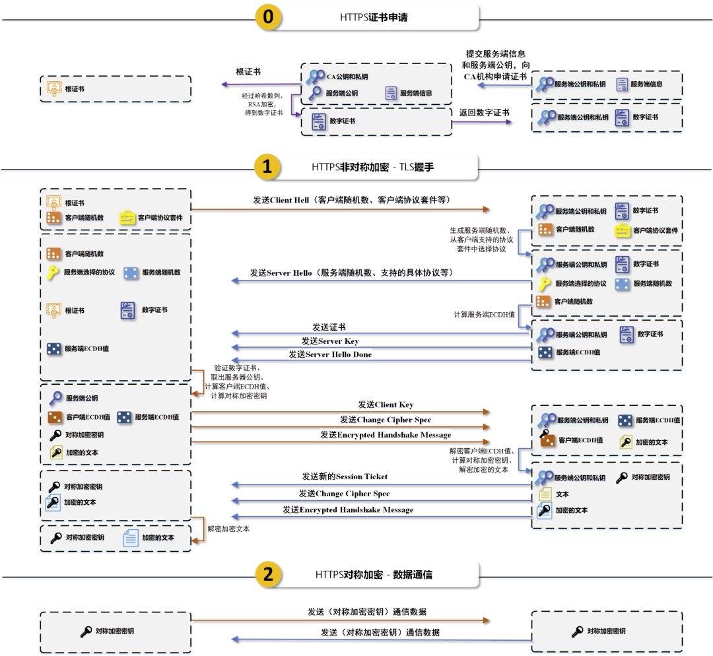

| 状态码       | 定义               |
| :-------- | :--------------- |
| 1xx 报告    | 接收到请求，继续进程       |
| 2xx 成功    | 步骤成功接收，被理解，并被接受  |
| 3xx 重定向   | 为了完成请求,必须采取进一步措施 |
| 4xx 客户端出错 | 请求包括错的顺序或不能完成    |
| 5xx 服务器出错 | 服务器无法完成显然有效的请求   |

403: Forbidden

404: Not Found

# HTTPS

### HTTPS  

HTTPS协议 = HTTP协议 + SSL/TLS协议 

- SSL的全称是Secure Sockets Layer，即安全套接层协议，是为网络通信提供安全及数据完整性的一种安全协议。SSL协议在1994年被Netscape发明，后来各个浏览器均支持SSL，其最新的版本是3.0
- TLS的全称是Transport Layer Security，即安全传输层协议，最新版本的TLS（Transport Layer Security，传输层安全协议）是IETF（Internet Engineering Task Force，Internet工程任务组）制定的一种新的协议，它建立在SSL 3.0协议规范之上，是SSL 3.0的后续版本。在TLS与SSL3.0之间存在着显著的差别，主要是它们所支持的加密算法不同，所以TLS与SSL3.0不能互操作。  

虽然TLS与SSL3.0在加密算法上不同，但是在我们理解HTTPS的过程中，我们可以把SSL和TLS看做是同一个协议。  

HTTPS为了兼顾安全与效率，同时使用了**对称加密**和**非对称**加密。  

对数据进行对称加密，对称加密所要使用的密钥通过非对称加密传输。  

过程图示意:
 
详解：

一个HTTPS请求实际上包含了两次HTTP传输，可以细分为8步。

1. 客户端向服务器发起HTTPS请求，连接到服务器的443端口
2. 服务器端有一个密钥对，即公钥和私钥，是用来进行非对称加密使用的，服务器端保存着私钥，不能将其泄露，公钥可以发送给任何人。
3. 服务器将自己的公钥发送给客户端。s
4. 客户端收到服务器端的证书之后，会对证书进行检查，验证其合法性，如果发现发现证书有问题，那么HTTPS传输就无法继续。严格的说，这里应该是验证服务器发送的数字证书的合法性，关于客户端如何验证数字证书的合法性，下文会进行说明。如果公钥合格，那么客户端会生成一个随机值，这个随机值就是用于进行对称加密的密钥，我们将该密钥称之为client key，即客户端密钥，这样在概念上和服务器端的密钥容易进行区分。然后用服务器的公钥对客户端密钥进行非对称加密，这样客户端密钥就变成密文了，至此，HTTPS中的第一次HTTP请求结束。
5. 客户端会发起HTTPS中的第二个HTTP请求，将加密之后的客户端密钥发送给服务器。
6. 服务器接收到客户端发来的密文之后，会用自己的私钥对其进行非对称解密，解密之后的明文就是客户端密钥，然后用客户端密钥对数据进行对称加密，这样数据就变成了密文。
7. 然后服务器将加密后的密文发送给客户端。
8. 客户端收到服务器发送来的密文，用客户端密钥对其进行对称解密，得到服务器发送的数据。这样HTTPS中的第二个HTTP请求结束，整个HTTPS传输完成。
 

### HTTPS在传输的过程中会涉及到三个密钥
  

- 服务器端的公钥和私钥，用来进行非对称加密
- 客户端生成的随机密钥，用来进行对称加密
# HTTP
## HTTP的长连接和短连接?

HTTP的长连接和短连接本质上是TCP长连接和短连接。HTTP属于应用层协议.

短连接:浏览器和服务器每进行一次HTTP操作，就建立一次连接，但任务结束就中断连接。

长连接:当一个网页打开完成后，客户端和服务器之间用于传输HTTP数据的 TCP连接不会关闭，如果客户端再次访问这个服务器上的网页，会继续使用这一条已经建立的连接。Keep-Alive不会永久保持连接，它有一个保持时间，可以在不同的服务器软件（如Apache）中设定这个时间。实现长连接要客户端和服务端都支持长连接。

TCP短连接: client向server发起连接请求，server接到请求，然后双方建立连接。client向server发送消息，server回应client，然后一次读写就完成了，这时候双方任何一个都可以发起close操作，不过一般都是client先发起 close操作.短连接一般只会在 client/server间传递一次读写操作

TCP长连接: client向server发起连接，server接受client连接，双方建立连接。Client与server完成一次读写之后，它们之间的连接并不会主动关闭，后续的读写操作会继续使用这个连接。

## HTTP优化方案：

1. TCP复用：TCP连接复用是将多个客户端的HTTP请求复用到一个服务器端TCP连接上，而HTTP复用则是一个客户端的多个HTTP请求通过一个TCP连接进行处理。前者是负载均衡设备的独特功能；而后者是HTTP 1.1协议所支持的新功能
2. 内容缓存：将经常用到的内容进行缓存起来，那么客户端就可以直接在内存中获取相应的数据了。
3. 压缩：将文本数据进行压缩，减少带宽
4. SSL加速（SSL Acceleration）：使用SSL协议对HTTP协议进行加密，在通道内加密并加速
5. TCP缓冲：通过采用TCP缓冲技术，可以提高服务器端响应时间和处理效率，减少由于通信链路问题给服务器造成的连接负担。 

## HTTP1.0 HTTP 1.1主要区别
  
- 长连接

HTTP 1.0需要使用keep-alive参数来告知服务器端要建立一个长连接，而HTTP1.1默认支持长连接。
HTTP是基于TCP/IP协议的，创建一个TCP连接是需要经过三次握手的,有一定的开销，如果每次通讯都要重新建立连接的话，对性能有影响。因此最好能维持一个长连接，可以用个长连接来发多个请求。
- 节约带宽
HTTP 1.1支持只发送header信息(不带任何body信息)，如果服务器认为客户端有权限请求服务器，则返回100，否则返回401。客户端如果接受到100，才开始把请求body发送到服务器。
这样当服务器返回401的时候，客户端就可以不用发送请求body了，节约了带宽。
另外HTTP还支持传送内容的一部分。这样当客户端已经有一部分的资源后，只需要跟服务器请求另外的部分资源即可。这是支持文件断点续传的基础。
- HOST域
现在可以web server例如tomat，设置虚拟站点是非常常见的，也即是说，web server上的多个虚拟站点可以共享同一个ip和端口。
HTTP1.0是没有host域的，HTTP1.1才支持这个参数。

HTTP1.1 HTTP 2.0主要区别
- 多路复用
HTTP2.0使用了(类似epoll)多路复用的技术，做到同一个连接并发处理多个请求，而且并发请求的数量比HTTP1.1大了好几个数量级。
当然HTTP1.1也可以多建立几个TCP连接，来支持处理更多并发的请求，但是创建TCP连接本身也是有开销的。
TCP连接有一个预热和保护的过程，先检查数据是否传送成功，一旦成功过，则慢慢加大传输速度。因此对应瞬时并发的连接，服务器的响应就会变慢。所以最好能使用一个建立好的连接，并且这个连接可以支持瞬时并发的请求。
- 数据压缩
HTTP1.1不支持header数据的压缩，HTTP2.0使用HPACK算法对header的数据进行压缩，这样数据体积小了，在网络上传输就会更快。
- 服务器推送
意思是说，当我们对支持HTTP2.0的web server请求数据的时候，服务器会顺便把一些客户端需要的资源一起推送到客户端，免得客户端再次创建连接发送请求到服务器端获取。这种方式非常合适加载静态资源。
服务器端推送的这些资源其实存在客户端的某处地方，客户端直接从本地加载这些资源就可以了，不用走网络，速度自然是快很多的。 
## URI和URL  

各自的组成

1. URI
Web上可用的每种资源如HTML文档、图像、视频片段、程序等都是一个来URI来定位的；
URI一般由三部组成
①访问资源的命名机制
②存放资源的主机名
③资源自身的名称，由路径表示，着重强调于资源。

2. URL

URL是Internet上用来描述信息资源的字符串，主要用在各种WWW客户程序和服务器程序上，特别是著名的Mosaic。
采用URL可以用一种统一的格式来描述各种信息资源，包括文件、服务器的地址和目录等。
URL一般由三部组成
①协议(或称为服务方式)
②存有该资源的主机IP地址(有时也包括端口号)
③主机资源的具体地址。如目录和文件名等
URI：Uniform Resource Identifier，统一资源标识符
URL：Uniform Resource Location统一资源定位符 

##### 关系

URI是一个用于标识互联网资源名称的字符串。 该种标识允许用户对网络中（一般指万维网）的资源通过特定的协议进行交互操作。URI的最常见的形式是统一资源定位符（URL），经常指定为非正式的网址。更罕见的用法是统一资源名称（URN），其目的是通过提供一种途径。用于在特定的命名空间资源的标识，以补充网址。
通俗地说，URL和URN是URI的子集，URI属于URL更高层次的抽象，一种字符串文本标准。
##### 有什么区别 

- URI，是统一资源标识符，用来唯一的标识一个资源。
- URL是统一资源定位器，它是一种具体的URI，即URL可以用来标识一个资源，而且还指明了如何locate这个资源。
- URN，统一资源命名，是通过名字来标识资源，比如mailto:java-net@java.sun.com。

  
也就是说，URI是以一种抽象的，高层次概念定义统一资源标识，而URL和URN则是具体的资源标识的方式。URL和URN都是一种URI；
URL是URI的一种。但也不是所有的URI都是URL哦，就好像蝴蝶都会飞，但会飞的可不都是蝴蝶啊！
让URI能成为URL的当然就是那个“访问机制”，“网络位置”。e.g. http://

or ftp://. URI是唯一标识的一部分，就是一个特殊的名字。

## 什么是Http协议无状态协议?怎么解决Http协议无状态协议?

无状态协议对于事务处理没有记忆能力，缺少状态意味着如果后续处理需要前面的信息

也就是说，当客户端一次HTTP请求完成以后，客户端再发送一次HTTP请求，HTTP并不知道当前客户端是一个"老用户"。

可以使用Cookie来解决无状态的问题，Cookie就相当于一个通行证，第一次访问的时候给客户端发送一个Cookie，当客户端再次来的时候，拿着Cookie(通行证)，那么服务器就知道这个是"老用户"。

  

# HTTP与HTTPS的区别：

1. HTTP 的URL 以http://开头，而HTTPS 的URL 以https://开头
2. HTTP 是不安全的，而 HTTPS 是安全的
3. HTTP 标准端口是80 ，而 HTTPS 的标准端口是443
4. 在OSI 网络模型中，HTTP工作于应用层，而HTTPS 的安全传输机制工作在传输层（SSL TLS工作在会话层）
5. HTTP 无法加密，而HTTPS 对传输的数据进行加密
6. HTTP无需证书，而HTTPS 需要CA机构颁发的SSL证书  

# 幂等 Idempotence

  HTTP方法的幂等性是指一次和多次请求某一个资源应该具有同样的**副作用**。(注意是副作用)
  
`GET http://www.bank.com/account/123456`，不会改变资源的状态，不论调用一次还是N次都没有副作用。请注意，这里强调的是一次和N次具有相同的副作用，而不是每次GET的结果相同。`GET http://www.news.com/latest-news`这个HTTP请求可能会每次得到不同的结果，但它本身并没有产生任何副作用，因而是满足幂等性的。

DELETE方法用于删除资源，有副作用，但它应该满足幂等性。比如：`DELETE http://www.forum.com/article/4231`，调用一次和N次对系统产生的副作用是相同的，即删掉id为4231的帖子；因此，调用者可以多次调用或刷新页面而不必担心引起错误。

POST所对应的URI并非创建的资源本身，而是资源的接收者。比如：`POST http://www.forum.com/articles`的语义是在`http://www.forum.com/articles`下创建一篇帖子，HTTP响应中应包含帖子的创建状态以及帖子的URI。两次相同的POST请求会在服务器端创建两份资源，它们具有不同的URI；所以，POST方法不具备幂等性。

PUT所对应的URI是要创建或更新的资源本身。比如：`PUT http://www.forum/articles/4231`的语义是创建或更新ID为4231的帖子。对同一URI进行多次PUT的副作用和一次PUT是相同的；因此，PUT方法具有幂等性。
