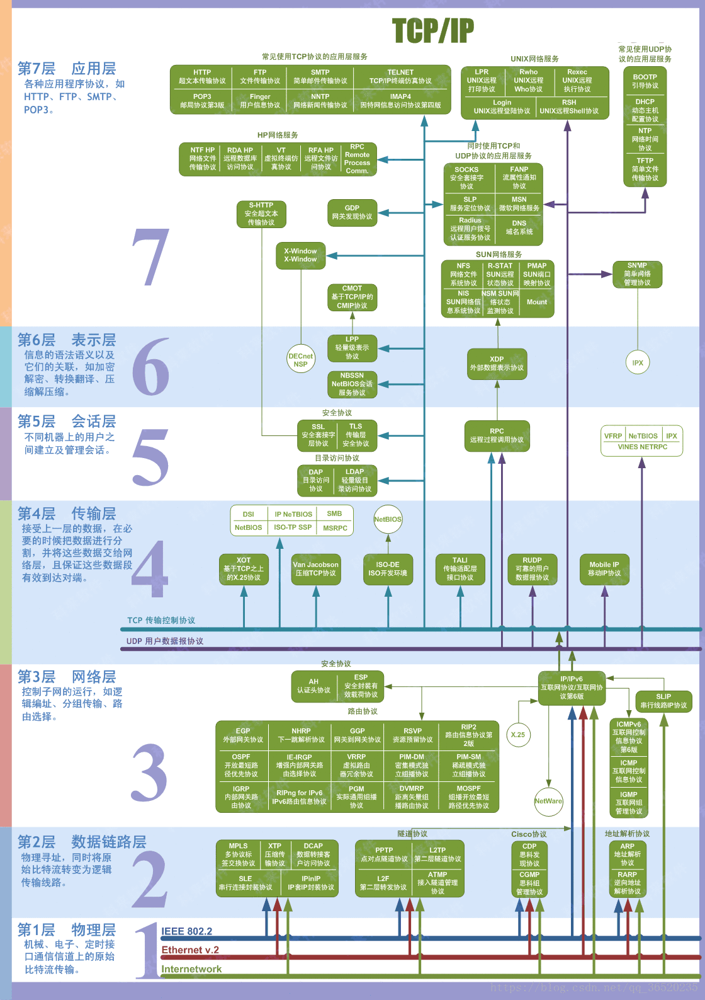

# 一、OSI，TCP/IP，五层协议的体系结构，以及各层协议
# 一、OSI，TCP/IP，五层协议的体系结构，以及各层协议

OSI分层 （7层）：物理层、数据链路层、网络层、传输层、会话层、表示层、应用层。  
TCP/IP分层（4层）：网络接口层、 网际层、运输层、 应用层。  
五层协议 （5层）：物理层、数据链路层、网络层、运输层、 应用层。

## 每一层的协议如下：

物理层：RJ45、CLOCK、IEEE802.3 （中继器，集线器，网关）  
数据链路：PPP、FR、HDLC、VLAN、MAC （网桥，交换机）  
网络层：IP、ICMP、ARP、RARP、OSPF、IPX、RIP、IGRP、 （路由器）  
传输层：TCP、UDP、SPX  
会话层：NFS、SQL、NETBIOS、RPC  
表示层：JPEG、MPEG、ASII  
应用层：FTP、DNS、Telnet、SMTP、HTTP、WWW、NFS

## 每一层的作用如下：

物理层：通过媒介传输比特,确定机械及电气规范（比特Bit）  
数据链路层：将比特组装成帧和点到点的传递（帧Frame）  
网络层：负责数据包从源到宿的传递和网际互连（包PackeT）  
传输层：提供端到端的可靠报文传递和错误恢复（段Segment）  
会话层：建立、管理和终止会话（会话协议数据单元SPDU）  
表示层：对数据进行翻译、加密和压缩（表示协议数据单元PPDU）  
应用层：允许访问OSI环境的手段（应用协议数据单元APDU）

### 运输层协议与网络层协议的区别？

网络层协议负责的是提供主机间的逻辑通信  
运输层协议负责的是提供进程间的逻辑通信

### 数据链路层协议可能提供的服务？

成帧、链路访问、透明传输、可靠交付、流量控制、差错检测、差错纠正、半双工和全双工。最重要的是帧定界（成帧）、透明传输以及差错检测。

# 二、IP地址的分类

A类地址：以0开头， 第一个字节范围：0~127（1.0.0.1 - 126.255.255.254）；

B类地址：以10开头， 第一个字节范围：128~191（128.0.0.1 - 191.255.255.254）；

C类地址：以110开头， 第一个字节范围：192~223（192.0.0.1- 223.255.255.254）；

10.0.0.0—10.255.255.255， 172.16.0.0—172.31.255.255， 192.168.0.0—192.168.255.255。（Internet上保留地址用于内部）

IP地址与子网掩码相与得到主机号

# 三、各种协议

## 3.1 ARP是地址解析协议，简单语言解释一下工作原理。

1：首先，每个主机都会在自己的ARP缓冲区中建立一个ARP列表，以表示IP地址和MAC地址之间的对应关系。

2：当源主机要发送数据时，首先检查ARP列表中是否有对应IP地址的目的主机的MAC地址，如果有，则直接发送数据，如果没有，就向本网段的所有主机发送ARP数据包，该数据包包括的内容有：源主机IP地址，源主机MAC地址，目的主机的IP地址。

3：当本网络的所有主机收到该ARP数据包时，首先检查数据包中的IP地址是否是自己的IP地址，如果不是，则忽略该数据包，如果是，则首先从数据包中取出源主机的IP和MAC地址写入到ARP列表中，如果已经存在，则覆盖，然后将自己的MAC地址写入ARP响应包中，告诉源主机自己是它想要找的MAC地址。

4：源主机收到ARP响应包后。将目的主机的IP和MAC地址写入ARP列表，并利用此信息发送数据。如果源主机一直没有收到ARP响应数据包，表示ARP查询失败。  
广播发送ARP请求，单播发送ARP响应。

## 3.2 ICMP协议

因特网控制报文协议。它是TCP/IP协议族的一个子协议，用于在IP主机、路由器之间传递控制消息。

## 3.3 TFTP协议

是TCP/IP协议族中的一个用来在客户机与服务器之间进行简单文件传输的协议，提供不复杂、开销不大的文件传输服务。

## 3.4 HTTP协议

超文本传输协议，是一个属于应用层的面向对象的协议，由于其简捷、快速的方式，适用于分布式超媒体信息系统。

## 3.5 DHCP协议

动态主机配置协议，是一种让系统得以连接到网络上，并获取所需要的配置参数手段。一个局域网的网络协议，使用UDP协议工作，用途：给内部网络或网络服务供应商自动分配IP地址，给用户或者内部网络管理员作为对所有计算机作中央管理的手段。

## 3.6 NAT协议

网络地址转换属接入广域网(WAN)技术，是一种将私有（保留）地址转化为合法IP地址的转换技术，

## 3.7 RARP

RARP是逆地址解析协议，作用是完成硬件地址到IP地址的映射，主要用于无盘工作站，因为给无盘工作站配置的IP地址不能保存。工作流程：在网络中配置一台RARP服务器，里面保存着IP地址和MAC地址的映射关系，当无盘工作站启动后，就封装一个RARP数据包，里面有其MAC地址，然后广播到网络上去，当服务器收到请求包后，就查找对应的MAC地址的IP地址装入响应报文中发回给请求者。因为需要广播请求报文，因此RARP只能用于具有广播能力的网络。

## 如果已经建立了连接，但是客户端突然出现故障了怎么办？

TCP还设有一个保活计时器，显然，客户端如果出现故障，服务器不能一直等下去，白白浪费资源。服务器每收到一次客户端的请求后都会重新复位这个计时器，时间通常是设置为2小时，若两小时还没有收到客户端的任何数据，服务器就会发送一个探测报文段，以后每隔75分钟发送一次。若一连发送10个探测报文仍然没反应，服务器就认为客户端出了故障，接着就关闭连接。

# 五、在浏览器中输入www.baidu.com后执行的全部过程

1、客户端浏览器通过[DNS解析](https://blog.csdn.net/m0_37812513/article/details/78775629)到www.baidu.com的IP地址220.181.27.48，通过这个IP地址找到客户端到服务器的路径。客户端浏览器发起一个HTTP会话到220.161.27.48，然后通过TCP进行封装数据包，输入到网络层。

2、在客户端的传输层，把HTTP会话请求分成报文段，添加源和目的端口，如服务器使用80端口监听客户端的请求，客户端由系统随机选择一个端口如5000，与服务器进行交换，服务器把相应的请求返回给客户端的5000端口。然后使用IP层的IP地址查找目的端。

3、客户端的网络层不用关系应用层或者传输层的东西，主要做的是通过查找路由表确定如何到达服务器，期间可能经过多个路由器，这些都是由路由器来完成的工作，我不作过多的描述，无非就是通过查找路由表决定通过那个路径到达服务器。

4、客户端的链路层，包通过链路层发送到路由器，通过邻居协议查找给定IP地址的MAC地址，然后发送ARP请求查找目的地址，如果得到回应后就可以使用ARP的请求应答交换的IP数据包现在就可以传输了，然后发送IP数据包到达服务器的地址。

# 六、
# 七、IP数据包的格式

IP数据报由首部 和数据 两部分组成。首部由固定部分和可选部分 组成。首部的固定部分有20字节。可选部分的长度变化范围为1——40字节。固定部分的字段：

字段名 位数（bit） 字段名 位数

| 版本   | 4 Ipv4                                                                                                   | 首部长度  | 4（表示的最大数为15个单位，一个单位表示4字节）                                                                                      |
| ---- | -------------------------------------------------------------------------------------------------------- | ----- | -------------------------------------------------------------------------------------------------------------- |
| 服务类型 | 8 以前很少用                                                                                                  | 总长度   | 16 （首部和数据部分的总长度，因此数据报的最大长度为65535字节，即64KB，但是由于链路层的MAC都有一定的最大传输单元，因此IP数据报的长度一般都不会有理论上的那么大，如果超出了MAC的最大单元就会进行分片）   |
| 标识   | 16 （相同的标识使得分片后的数据报片能正确的重装成原来的数据报）                                                                        | 标志    | 3 （最低位MF=1表示后面还有分片，MF=0表示这是若干个数据报片的最后一个中间位DF=0才允许分片）                                                           |
| 片偏移  | 片偏移指出较长的分组在分片后，某片在原分组中的相对位置，都是8字节的偏移位置                                                                   | 生存时间  | 数据报在网络中的生存时间，指最多经过路由器的跳数                                                                                       |
| 协议   | 8 （指出该数据报携带的数据是何种协议，以使得目的主机的IP层知道应将数据部分上交给哪个处理程序）如ICMP=1 IGMP=2 TCP=6 EGP=8 IGP=9 UDP=17 Ipv6=41 OSPF=89 | 首部校验和 | 这个部分只校验首部，不包括数据部分，计算方法：将首部划分为多个16位的部分，然后每个16位部分取反，然后计算和，再将和取反放到首部校验和。接收方收到后按同样的方法划分，取反，求和，在取反，如果结果为零，则接收，否则就丢弃 |
| 源地址  | 32                                                                                                       | 目的地址  | 32                                                                                                             |

# 九、了解交换机、路由器、网关的概念，并知道各自的用途

1）交换机

在计算机网络系统中，交换机是针对共享工作模式的弱点而推出的。交换机拥有一条高带宽的背部总线和内部交换矩阵。交换机的所有的端口都挂接在这条背 部总线上，当控制电路收到数据包以后，处理端口会查找内存中的地址对照表以确定目的MAC（网卡的硬件地址）的NIC（网卡）挂接在哪个端口上，通过内部 交换矩阵迅速将数据包传送到目的端口。目的MAC若不存在，交换机才广播到所有的端口，接收端口回应后交换机会“学习”新的地址，并把它添加入内部地址表 中。

交换机工作于OSI参考模型的第二层，即数据链路层。交换机内部的CPU会在每个端口成功连接时，通过ARP协议学习它的MAC地址，保存成一张 ARP表。在今后的通讯中，发往该MAC地址的数据包将仅送往其对应的端口，而不是所有的端口。因此，交换机可用于划分数据链路层广播，即冲突域；但它不 能划分网络层广播，即广播域。

交换机被广泛应用于二层网络交换，俗称“二层交换机”。

交换机的种类有：二层交换机、三层交换机、四层交换机、七层交换机分别工作在OSI七层模型中的第二层、第三层、第四层和第七层，并因此而得名。

2）路由器

路由器（Router）是一种计算机网络设备，提供了路由与转送两种重要机制，可以决定数据包从来源端到目的端所经过 的路由路径（host到host之间的传输路径），这个过程称为路由；将路由器输入端的数据包移送至适当的路由器输出端(在路由器内部进行)，这称为转 送。路由工作在OSI模型的第三层——即网络层，例如网际协议。

路由器的一个作用是连通不同的网络，另一个作用是选择信息传送的线路。 路由器与交换器的差别，路由器是属于OSI第三层的产品，交换器是OSI第二层的产品(这里特指二层交换机)。

#### 说说静态路由和动态路由有什么区别。

静态路由是由管理员手工配置的，适合比较简单的网络或需要做路由特殊控制。而动态路由则是由动态路由协议自动维护的，不需人工干预，适合比较复杂大型的网络。  
路由器能够自动地建立自己的路由表，并且能够根据实际实际情况的变化适时地进行调整。动态路由机制的运作依赖路由器的两个基本功能：对路由表的维护；路由器之间适时的路由信息交换。

#### 在Linux环境中怎么配置一条默认路由？

在linux上可以用“route add default gw<默认路由器 IP>”命令配置一条默认路由。

3）网关

网关（Gateway），网关顾名思义就是连接两个网络的设备，区别于路由器（由于历史的原因，许多有关TCP/IP 的文献曾经把网络层使用的路由器（Router）称为网关，在今天很多局域网采用都是路由来接入网络，因此现在通常指的网关就是路由器的IP），经常在家 庭中或者小型企业网络中使用，用于连接局域网和Internet。 网关也经常指把一种协议转成另一种协议的设备，比如语音网关。

在传统TCP/IP术语中，网络设备只分成两种，一种为网关（gateway），另一种为主机（host）。网关能在网络间转递数据包，但主机不能 转送数据包。在主机（又称终端系统，end system）中，数据包需经过TCP/IP四层协议处理，但是在网关（又称中介系 统，intermediate system）只需要到达网际层（Internet layer），决定路径之后就可以转送。在当时，网关 （gateway）与路由器（router）还没有区别。

在现代网络术语中，网关（gateway）与路由器（router）的定义不同。网关（gateway）能在不同协议间移动数据，而路由器（router）是在不同网络间移动数据，相当于传统所说的IP网关（IP gateway）。

网关是连接两个网络的设备，对于语音网关来说，他可以连接PSTN网络和以太网，这就相当于VOIP，把不同电话中的模拟信号通过网关而转换成数字信号，而且加入协议再去传输。在到了接收端的时候再通过网关还原成模拟的电话信号，最后才能在电话机上听到。

对于以太网中的网关只能转发三层以上数据包，这一点和路由是一样的。而不同的是网关中并没有路由表，他只能按照预先设定的不同网段来进行转发。网关最重要的一点就是端口映射，子网内用户在外网看来只是外网的IP地址对应着不同的端口，这样看来就会保护子网内的用户。

4）网络接口卡（网卡）的功能？

（1）进行串行/并行转换。

（2）对数据进行缓存。

（3）在计算机的操作系统安装设备驱动程序。

（4）实现以太网协议。  
5）网桥的作用？

网桥是一个局域网与另一个局域网之间建立连接的桥梁

# 十、IO中同步与异步，阻塞与非阻塞区别

同步和异步关注的是消息通信机制 (synchronous communication/asynchronous communication)  
所谓同步，就是在发出一个调用时，在没有得到结果之前，该调用就不返回。但是一旦调用返回，就得到返回值了。  
换句话说，就是由调用者主动等待这个调用的结果。  
而异步则是相反，调用在发出之后，这个调用就直接返回了，所以没有返回结果。换句话说，当一个异步过程调用发出后，调用者不会立刻得到结果。而是在调用发出后，被调用者通过状态、通知来通知调用者，或通过回调函数处理这个调用。

阻塞和非阻塞关注的是程序在等待调用结果（消息，返回值）时的状态.

阻塞调用是指调用结果返回之前，当前线程会被挂起。函数只有在得到结果之后才会返回。

非阻塞：不能立刻得到结果之前，该函数不会阻塞当前线程，而会立刻返回。

  

# 假设这样一个场景，客户端在和服务端进行TCP的三次握手的过程中，突然间客户端宕机了，那么这个socket怎么处理？可以删除吗？是怎么删除的？

  

如果客户端在 TCP 三次握手过程中宕机了，服务端将无法收到完整的握手消息，此时服务端会一直等待客户端发送握手消息。为了避免这种情况，可以在服务端设置超时时间，如果在规定时间内没有收到握手消息，就将该 socket 关闭。关闭 socket 的方法是调用 close() 或者 shutdown() 函数。

  

# 在服务端调用accept()之后,socket就是一直可读的吗？就是调用read()函数就一直可以读吗？会阻塞吗？

  

在服务端调用 accept() 后，返回的套接字是可读的，但不一定一直可读。此时可以使用 select()、poll() 或 epoll() 等函数来检测套接字上是否有数据可读。如果套接字没有数据可读，则一般情况下会阻塞，直到有数据可读或者超时。

  

# 如果服务端read()函数发生了阻塞,对方客户端异常关闭了,一直没有发数据过来,服务端会一直阻塞吗？会导致服务端卡死吗？

  

如果服务端的 read() 函数发生阻塞，而对方客户端异常关闭了，一般情况下服务端会一直阻塞，直到发生超时或者其他异常情况。为了避免这种问题，可以设置非阻塞式 I/O，或者使用 select()、poll() 或 epoll() 等函数来监控套接字状态，并在发现异常情况时及时处理。

  

# 在第七题中提到的这个情况，epoll可以解决这个问题吗？如果要识别这个问题，怎么识别？

  

可以使用 epoll 来解决上述问题。在 epoll 中，可以设置超时时间和错误标志位，当超时或者发生错误时，可以及时关闭 socket。

  

# linux进程创建线程的流程是怎么样的？

  

## Linux进程可以使用pthread库中的函数来创建和管理线程。具体流程如下：

  

- 通过调用pthread_create()函数创建线程。

- 操作系统为新线程分配资源，包括栈空间、程序计数器等。

- 将新线程加入到进程的线程池中进行管理。

  
  

# 线程享进程的资源在linux中是怎么实现的？

  

Linux中实现线程共享进程资源的方式有两种：共享虚拟地址空间和使用同步机制。

  

## 共享虚拟地址空间

Linux中的线程共享进程的虚拟地址空间，也就是说所有线程都能够访问进程的全局变量和堆区内存。

  

## 同步机制

Linux中的线程共享进程的同步对象，例如信号量、互斥锁、条件变量等。这些同步对象可以保护共享资源，确保多个线程不会同时修改共享资源。

  
  

# 线程有自己私有的栈，那么这个栈的内存是被分配到哪里的？是放在进程所属的内存里面，还是说放在独立于进程外部的内存中？

  

Linux中的线程栈内存在进程的虚拟地址空间中。当线程被创建时，操作系统会为每个线程分配一块私有的栈空间，这个栈空间在进程的虚拟地址空间中被分配。不同线程之间的栈空间是独立的，互相不会干扰。

  

# 什么是协程？协程有什么用？

  

协程是一种用户态线程，也被称为轻量级线程。协程可以在同一个线程内部进行切换，而不像普通线程需要通过系统调用切换上下文，因此协程具有轻量、高效、灵活等特点。

  

协程的主要用途是解决IO密集型应用程序中的并发问题，如网络编程、Web服务器等。通过使用协程，可以避免大量线程之间频繁切换上下文的开销，提高应用程序的并发性能。同时，协程可以简化编程模型，使得代码更易于编写和维护。

  

# 进程的虚拟地址空间

  

进程的虚拟地址空间是一个抽象的概念，它代表了进程所能访问到的内存地址范围。在现代操作系统中，每个进程都有自己独立的虚拟地址空间，这样可以保证每个进程之间的内存空间相互隔离，互不干扰。

  

虚拟地址空间包含了进程的所有内存区域，包括：

  

代码段：存放可执行程序代码的部分。

数据段：存放已经初始化的全局变量和静态变量等。

BSS段：存放未初始化的全局变量和静态变量等。

堆区：用于动态分配内存，通常使用malloc()等函数从堆区申请内存。

栈区：用于存储函数调用时的局部变量、参数以及函数返回值等。

进程的虚拟地址空间为每个进程提供了一个独立的内存空间，在该空间内，每个进程都可以按照自己的需要对内存进行读写操作，而不会影响到其他进程的内存空间。

  

# epoll中可以无限承载socket的连接吗？创建socket时返回值是什么

  

在 epoll 中，可以支持非常高的并发连接，理论上可以承载无限量的 socket 连接，但实际上会受到系统资源的限制。同时需要注意的是，在支持大量连接时，还需要考虑网络带宽、CPU 和内存等方面的问题。

  

创建 socket 时，如果成功则返回一个新的文件描述符，用于后续的操作，如果失败则返回 -1。在使用 epoll 监听时，需要将这个文件描述符加入到 epoll 实例的事件列表中，以便检测该 socket 上的事件。加入事件列表时，需要指定要监听的事件类型和相关参数，并且可以设置一些选项，例如 ET/LT 模式和边缘触发/水平触发等。

  

总之，在处理大量连接的情况下，使用 epoll 可以更好地管理和监控套接字的状态和事件，提高网络应用程序的性能和可伸缩性。

  

# select和epoll的区别

  

select 和 epoll 都是在网络编程中用于检测套接字上事件的函数，它们有以下区别：

  

1. 数据结构不同： select 函数使用 fd_set 作为描述符集合参数，而 epoll 函数使用 epoll_event 结构体数组作为描述符集合参数。

2. 效率不同： 在处理大量连接时，select 的效率很低。因为每次调用 select 函数时都需要将所有的监视对象从用户空间复制到内核空间，这样会发生大量的内存和 CPU 负载。而 epoll 可以避免这个问题，并可以显著提高效率。

3. 可伸缩性不同： epoll 支持 ET（边缘触发）模式，而 select 不支持。ET 模式下，只有当 IO 事件发生时，才会触发一次通知；而 LT（水平触发）模式则在 IO 事件未被处理时反复触发通知。ET 模式对于大规模连接情况的网络应用更有优势。

4. 限制不同： select 限制最大监视文件描述符的数量，通常为 1024；而 epoll 则没有这个限制。

  
  

因此，在处理大规模连接情况的网络应用中，推荐使用 epoll。