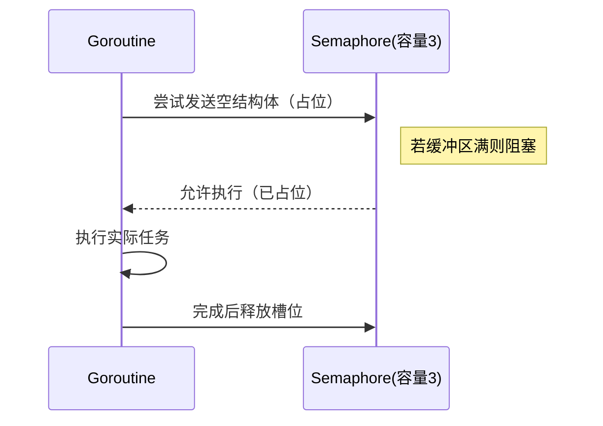

# printHelloWorld 打印hello world  控制 gorouting 并发调用hello world 函数，同一时间并发量不能超过3个

```go
package goroutine_like

import (
	"fmt"
	"sync"
	"time"
)

func printHelloWorld(id int, wg *sync.WaitGroup, semaphore chan struct{}) {
	defer wg.Done()
	// 获取信号量
	semaphore <- struct{}{}
	defer func() {
		<-semaphore // 释放信号量
	}()

	// 模拟耗时操作
	time.Sleep(1 * time.Second)
	fmt.Println("Hello World from Goroutine", id)
}

func start() {
	const (
		totolTasks    = 10 // 总任务数
		maxGoroutines = 3  // 最大并发数
	)
	var wg sync.WaitGroup
	semaphore := make(chan struct{}, maxGoroutines) // 信号量
	for i := 1; i <= totolTasks; i++ {
		wg.Add(1)
		go printHelloWorld(i, &wg, semaphore)
	}
	wg.Wait() // 等待所有 goroutine 完成
	fmt.Println("All goroutines finished.")
}

```

## 有的控制goroutine用的是比如：semaphore<- 这样，等待拿到后才往下进行，为什么这个是先自己创建个semaphore <- struct{}{} ？？

### 为什么选择 `semaphore <- struct{}{}` 这种写法？

#### 1. **信号量的本质区别**

这两种写法其实代表了**两种不同的信号量实现方式**，它们的核心区别在于：

| 方式 | 写法示例 | 工作原理 | 适用场景 |
|------|----------|----------|----------|
| **计数信号量** | `semaphore <- struct{}{}` | 通过通道的缓冲区大小控制并发数 | 控制最大并发量 |
| **二元信号量** | `<-semaphore` | 通过通道的发送/接收阻塞控制 | 严格的单步互斥 |

---

#### 2. **你的观察：两种常见模式**

##### 模式A（先发送后释放）

```go
semaphore <- struct{}{} // 先占位
defer func() { <-semaphore }() // 后释放
```

##### 模式B（先接收后发送）

```go
<-semaphore // 先等待允许信号
defer func() { semaphore <- struct{}{} }() // 后归还
```

---

#### 3. **为什么原代码采用模式A？**

##### 设计意图

```go
// 原代码的核心逻辑：
semaphore <- struct{}{}      // 1. 先尝试占位（阻塞直到有空位）
defer func() { <-semaphore } // 2. 确保最终释放
```

- **直观的"资源占用"语义**  

  类似于："我要一个工作许可证（先获取），用完再还回去（后释放）"

- **与通道缓冲区的自然映射**  

  `make(chan struct{}, 3)` 的缓冲区大小直接对应最大并发数

##### 执行流程



---

#### 4. **模式B的适用场景**

```go
// 另一种实现方式：
<-semaphore // 等待接收信号（初始化时需要预填充）
defer func() { semaphore <- struct{}{} }()
```

- **更适合：**
  - 需要严格按顺序激活的场景
  - 信号量需要动态调整的情况
- **典型问题：**
  ```go

  // 必须预先填充信号量！
  semaphore := make(chan struct{}, 3)
  for i := 0; i < 3; i++ {
      semaphore <- struct{}{} // 预填充
  }
  ```

---

#### 5. **为什么模式A更常见？**

| 优势 | 说明 |
|------|------|
| **初始化简单** | 无需预填充通道 |
| **资源控制直观** | `make(chan struct{}, N)` 的N即最大并发数 |
| **避免死锁风险** | 无需维护外部计数器 |
| **释放更可靠** | defer确保释放，即使发生panic |

---

#### 6. **底层原理对比**

```go
// 模式A的等效实现（通过sync包）：
var (
    semaphore = make(chan struct{}, 3)
    mu        sync.Mutex
    counter   int
)

func acquire() {
    mu.Lock()
    if counter >= 3 {
        mu.Unlock()
        <-semaphore // 等待释放
        mu.Lock()
    }
    counter++
    mu.Unlock()
}

// 可见模式A通过通道隐式实现了锁+计数器的复杂逻辑！
```

---

#### 7. **决策建议**
- **优先选择模式A**（原代码方式）当：
  - 需要简单的并发限制
  - 希望代码更简洁
- **考虑模式B**当：
  - 需要动态调整并发数（如弹性限流）
  - 需要实现优先级控制等复杂逻辑

两种方式最终达到的效果相同，但模式A的实现更符合Go"少即是多"的设计哲学。


# 线上报了软件使用内存异常过大，怎么去定位哪里出现了问题

见[go内存泄露](../Go/Go内存泄露.md)

# go垃圾回收
# go多线程，多进程怎么用，与go routing的区别
# 工作中与同事争论，怎么去解决争论